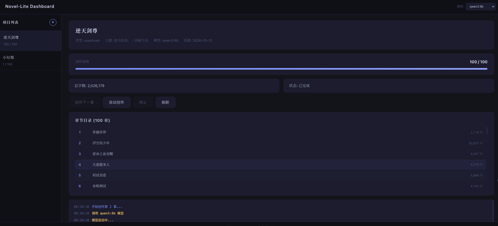
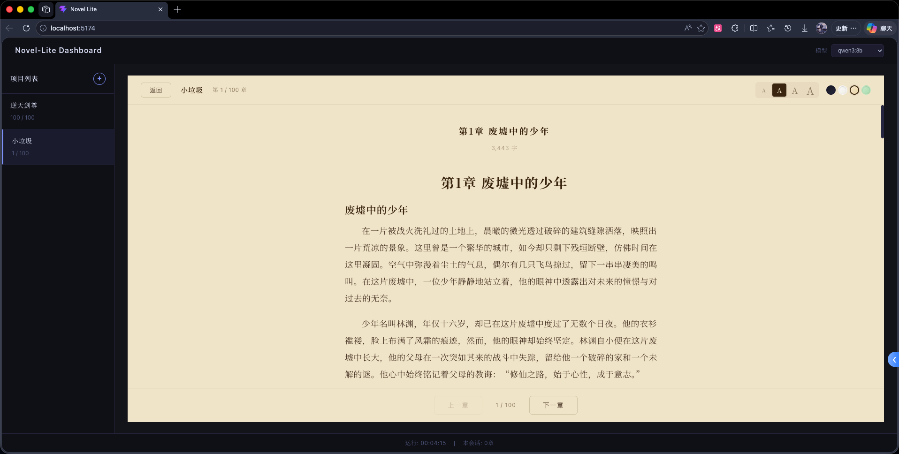

# WriteOnMac

基于 Ollama 本地大模型的 AI 小说创作系统。

## V1.0 正式版

```bash
cd novel-lite && pip install -r requirements-novel.txt
```

需要 Ollama 服务：`ollama serve`

### Web 看板

```bash
# 后端 localhost:8000
cd novel-lite/web && python server.py

# 前端 localhost:5173
cd novel-lite/web/client && npm install && npm run dev
```

## 预览





## 模块结构

```bash
npm run tauri build
```
novel-lite/
├── config.yaml       # 配置（模型、提示词模板）
├── ai.py             # AI 调用（generate / generate_stream）
├── core.py           # 核心业务
├── files.py          # 文件操作
├── cli.py            # 命令行入口
├── tui.py            # TUI 仪表盘（弃用）
└── web/              # Web Dashboard（FastAPI + React）
```